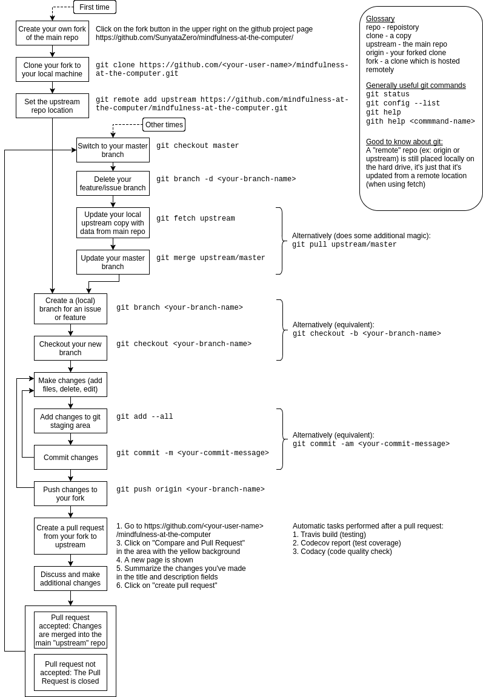

# Getting started for developers

## Interactions with other developers

[**Gitter chat /Lobby**](https://gitter.im/mindfulness-at-the-computer/Lobby) - real-time text chat about anything related to the project

### Open conversation policy

Unless conversations are clearly of a private nature, we can choose to share them with other team members. The reason for this policy is so that it does not take too long to relay information to others (otherwise the person who wants to relay information would need to wait for an email/chat response from the person she has been in conversation with).

### Reassigning issues

If there hasn't been an update for the progress on an issue in about 1-2 weeks we may reassign the issue to someone else. One reason for this is that we want new volunteers to be able to take on these issues.

### Conversations about issues in the gitter chat

Please use [the gitter chat](https://gitter.im/mindfulness-at-the-computer/Lobby) rather than issue comments for conversations about issues. The goal is that the issue has almost no comments and that a person new to an issue is easily able to grasp what the issue is about. If new information is gained it may be better to update the first issue comment

If you use comments to discuss issues please be aware that comments are removed now and then, and the description (first comment) is updated with information relevant to the issue

## How to report bugs

Please use the [bug report template](docs/templates/bug-report.md)

## Decision process

Overall design and architecture is determined by SunyataZero (Tord). In other words the project uses a so-called "benevolent dictatorship" structure. (Of course since this is free and open source software, anyone can - and are encouraged - to create a fork and create their own Mindfulness application which meets their needs❣)

We want discussions about all decisions to be open in the project and therefore, conversations that have started out as private can be made public without asking the participants (unless of course the conversation has been of a very personal nature)

## Contributor responsibility, money and license

No responsibility for any financial or other damage.

People contributing to the project are unpaid, it's entirely a volunteer effort. No money is made from this application at the time of writing (and there are no plans for this to change)

This application is Free Libre Open Source Software. The software license is GPLv3

## How do I get an overview of the project?

* Read about the [tech architecture](docs/tech-architecture.md) for the application
* Read the [advertisement for new people at code4socialgood](https://app.code4socialgood.org/project/view/932)
* If things are unclear, please ask in the [gitter chat](https://gitter.im/mindfulness-at-the-computer/Lobby)

## What can I do right now?

* Code reviews
* Write automated tests to increase code coverage
* This project is newbie-friendly and has [these issues](https://github.com/mindfulness-at-the-computer/mindfulness-at-the-computer/issues?q=is%3Aissue+is%3Aopen+label%3Afirst-timers-only) specifically for new people
* Check [the issue list](https://github.com/mindfulness-at-the-computer/mindfulness-at-the-computer/issues) to see if there are any issues marked with [help wanted](https://github.com/mindfulness-at-the-computer/mindfulness-at-the-computer/labels/help%20wanted)

## Pull Requests

1. Fork the repo (if you haven't already done so).
2. Clone it to your computer. You can do it using `git clone url_name`.
3. When you're ready to work on an issue, be sure you're on the **master** branch(Check using `git branch`). From there, create a separate branch. You can do this using `git checkout -b branch_name` where branch_name (e.g. issue_32) is the name of a new branch that you create.
4. Make your changes. Save the file. Go to the command line and do `git add file_name` to add it to the staging area.
5. Test the changes you've made manually to check that they are working okay
6. Run auto-tests to see if the changes you've made have impacted other parts of the application: `python -m unittest discover -s test` (on Ubuntu use `python3`)
5. Commit your changes. Do this using `git commit -m "comment about the changes made"`.
6. Push the working branch (e.g. issue_32) to your remote fork. This is done using `git push origin branch_name`.
7. Make the pull request (on the [upstream **master** branch](https://github.com/mindfulness-at-the-computer/mindfulness-at-the-computer/tree/master))
    * Do not merge it with the master branch on your fork. That would result in multiple, or unrelated patches being included in a single PR.
8. If any further changes need to be made, comments will be made on the pull request.

If you're unsure of some details while you're making edits, you can discuss them in the [Gitter chat room](https://gitter.im/mindfulness-at-the-computer/Lobby).

It's possible to work on two or more different patches (and therefore multiple branches) at one time, but it's recommended that beginners only work on one patch at a time.

### Syncing

Periodically, you'll need the sync your repo with mine (the upstream). GitHub has instructions for doing this

1. [Configuring a remote for a fork](https://help.github.com/articles/configuring-a-remote-for-a-fork/)
    * For step 3 on that page, use https://github.com/mindfulness-at-the-computer/mindfulness-at-the-computer for the URL.
2. [Syncing a Fork](https://help.github.com/articles/syncing-a-fork/)
    * On that page, it shows how to merge the **master** branch (steps 4 & 5 of **Syncing a Fork**).

### Workflow overview

## Translations

We need help localizing the application. Helping with translations is easy:
* You can add your name to our list of translators on [this wiki page](https://github.com/mindfulness-at-the-computer/mindfulness-at-the-computer/wiki/Translators)
* You can [**join us on crowdin**](https://crwd.in/mindfulness-at-the-computer) which is the system we use for adding translations and enter your translations there

## Website

The website has a separate github repo: https://github.com/mindfulness-at-the-computer/mindfulness-at-the-computer.github.io

***

### References
* Book "Producing open-source software"
  * http://producingoss.com/en/getting-started.html#developer-guidelines
  * http://producingoss.com/en/social-infrastructure.html
* [Advertisement for new people](misc/advertisement-for-devs.md)
