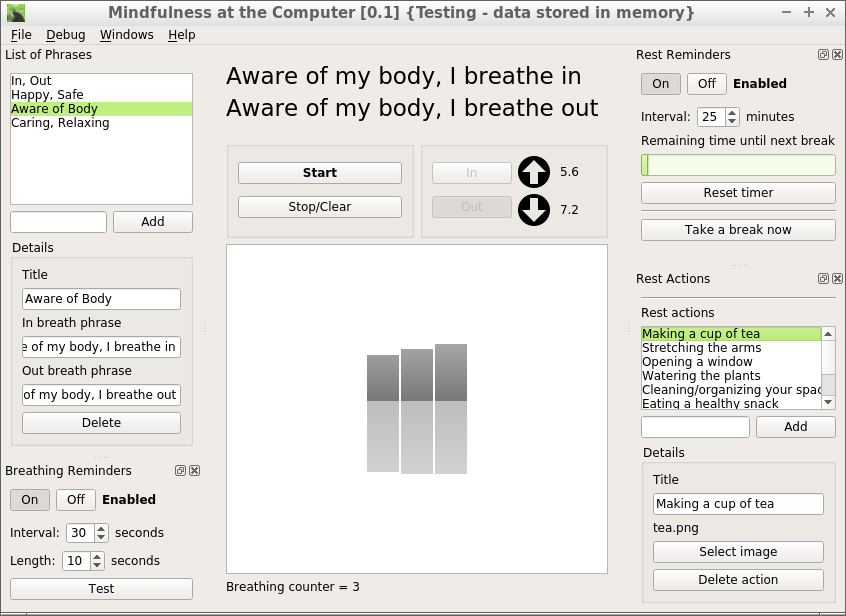
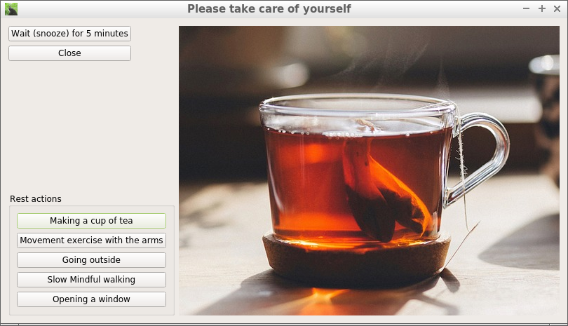
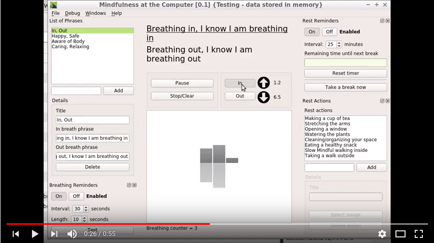

# Mindfulness at the Computer

A mindfulness and self-care application for people spending many hours in front of the computer

Features:
* **Following your in-breath and out-breath** with a graph displayed
  * Breathe with text help ("Breathing in I know I am breathing in") and write your own texts
* Receive notifications to remember to be **mindful of breathing** while the application runs in the background
* Get reminders when it's **time to take a break from the computer** while the application runs in the background

## Screenshots and Video

(These screenshots have been taken on a GNU/Linux system, it look a bit different for you)

### Main Window

### Breathing Notification

### Rest Reminder

### Video

Click on the image above to go to a youtube playlist with video examples

## Downloads

You can find built packages on the release page:

https://github.com/SunyataZero/mindfulness-at-the-computer/releases

(At the moment there's only an execuatable for 64 bit Linux)

## Running from Source

If there isn't a download for your platform (see the downloads section above) you can instead start the application by following these steps:

1. Download the Python 3.x installation package for your platform: https://www.python.org/downloads/
2. Install Python 3.x
3. On the command line: `pip install --upgrade pip` (On Ubuntu use `sudo -H` and `pip3` instead of `pip`)
4. On the command line: `pip install PyQt5` (On Ubuntu use `sudo -H` and `pip3` instead of `pip`)
5. Download the project files from GitHub, by clicking on *the green "Clone or download" button* and then "Download ZIP"
6. Unzip the downloaded file
7. Change directory to where the software files have been extracted
8. Type and run `python mindfulness-at-the-computer.py` on Windows or `python3 mindfulness-at-the-computer.py`on GNU/Linux systems

On MacOS you also need to install growl for the breathing reminder notifications to be shown

### Advanced Setup (Optional)

Please note: *This is not necessary for running the application*

#### GNU/Linux Systems

For desktop systems that are compatible with the [freedesktop](https://www.freedesktop.org/) standard - for example Gnome and KDE - you can use the bwb.desktop file included in the source (please note that if using a file manager such as the Gnome file manager you may see the name displayed as "Well-being Diary" rather than the file name) to make the application visible in any start-menu-like menu (in Lubuntu this is called the "main menu" and it's shown when clicking the button in the lower left, "vanilla" (the ordinary) Ubuntu may not have a menu like this

To use this file:

1. Edit the `mindfulness-at-the-computer.desktop` file and change the paths to match the path that you are using
2. Copy the `mindfulness-at-the-computer.desktop` file to your desktop or any place where you want to be able to start the application from
3. Copy the `mindfulness-at-the-computer.desktop` file to `/usr/share/applications/` using `sudo`

## Sign up for Updates

https://groups.google.com/forum/#!forum/mindfulness-at-the-computer

## License

**GPLv3**

## For Developers

* Developer documentation Link: TBD
* Other projects https://fswellbeing.github.io/

## User Documentation

### Following the breath

Click the "Start" button to start following the breath

To switch between in and out breath you can use one of the following methods:

* Press the in and out buttons
  * You can press the same button again, both the in and out button will switch state
* Use the keyboard by pressing and holding down the left or right shift key to breathe in and releasing to breathe out
* Hover over the up and down buttons with the mouse cursor

#### ...with a text

If you first select a breathing phrase in the list to the left you can breathe with the text

### Rest Reminders

Adding a new rest action

TBD: images

### Breathing Reminders

First select a breathing phrase in the list to the left

## Installation

See [Running from Source](#running-from-source) above

***

Aka: m@c, matc

