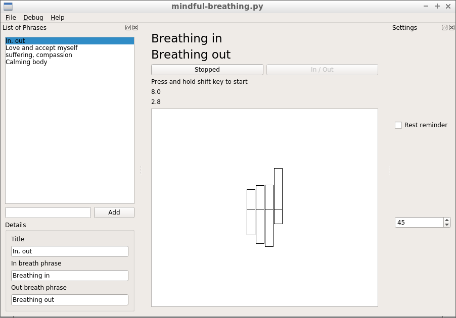
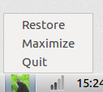

# Mindfulness at the Computer

Aka: m@c

Aka: matc

Welcome to this project site

Features:
* asdf
* 2

System requirements:

The application uses notifications, the system needs to support that for all features to work. On MacOS you need to install growl for notifications to be shown

## Screenshots

## Downloads

TBD

## Usage

TBD

Also see the [user documentation below](#user-documentation)

## Sign up for updates

Email list

## For developers

* Developer documentation Link: TBD
* Other projects https://fswellbeing.github.io/
* License: GPLv3

# User documentation

TBD

